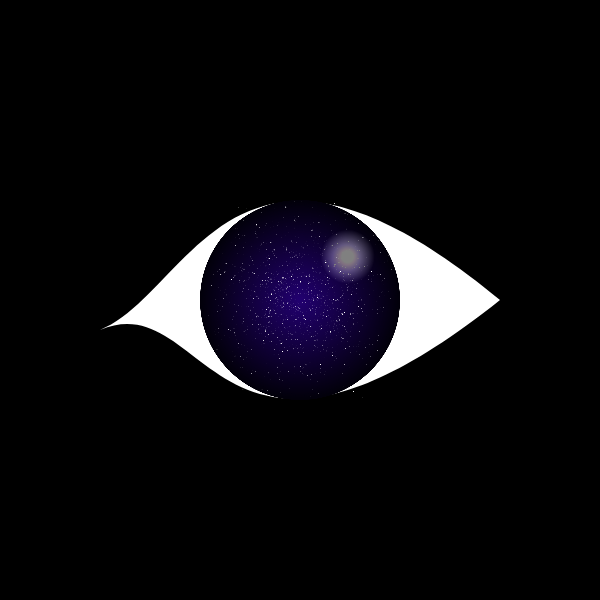

# [Eye](https://www.khanacademy.org/computer-programming/eye/4576765109944320)

## Skills: JavaScript, Randomness, Random Gaussian

## Date: June 2020

## Description: 
- A simple eye shape filled with stars. Learning about for loops and randomness.

## Snapshot:

