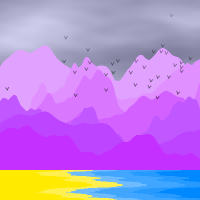

# [Purple Mountains](https://www.khanacademy.org/computer-programming/purple-mountains/5727562030006272)

## Skills: Perlin Noise, Randomness, Natural Simulations, JavaScript

## Date: Updated June 2021, Created April 2020

## Description: 
- Modifying the Natural Simulations tutorials to create art.

## Sources:
- https://www.khanacademy.org/computing/computer-programming/programming-natural-simulations/programming-noise/pp/project-mountain-range

## Snapshot:

