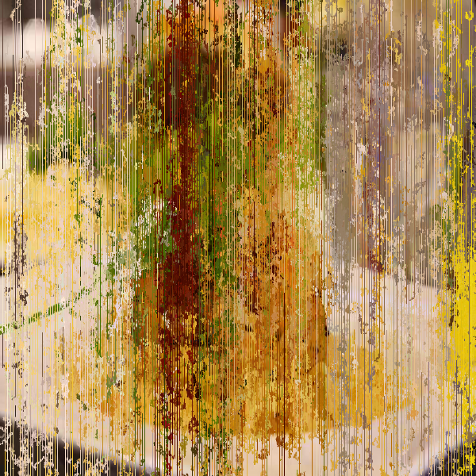

# [Airport Carpet](https://www.khanacademy.org/computer-programming/airport-carpet/5720609981775872)

## Skills: JS, particle systems, image manipulation

## Date: 8 Oct 2023

## Description: 
- Draws particles according to a pattern, carrying the image color with it. 
- Change the "mode" variable to see different patterns.
- Uses the KA image database.

## Sources:
- https://www.khanacademy.org/computing/computer-programming/programming-natural-simulations/programming-particle-systems/a/intro-to-particle-systems

## Snapshots:

